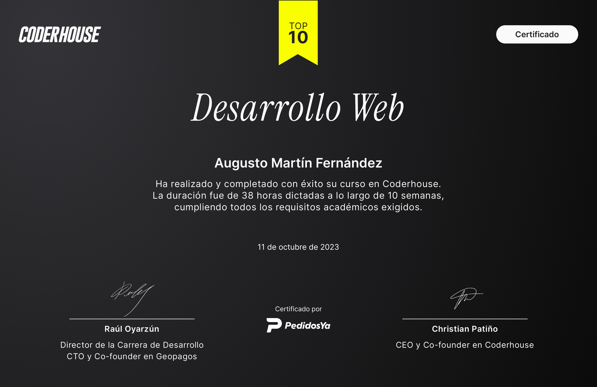
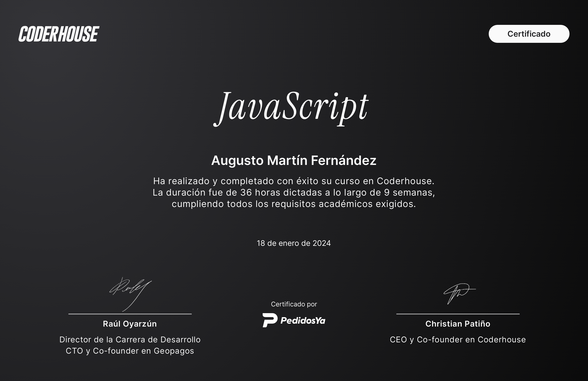
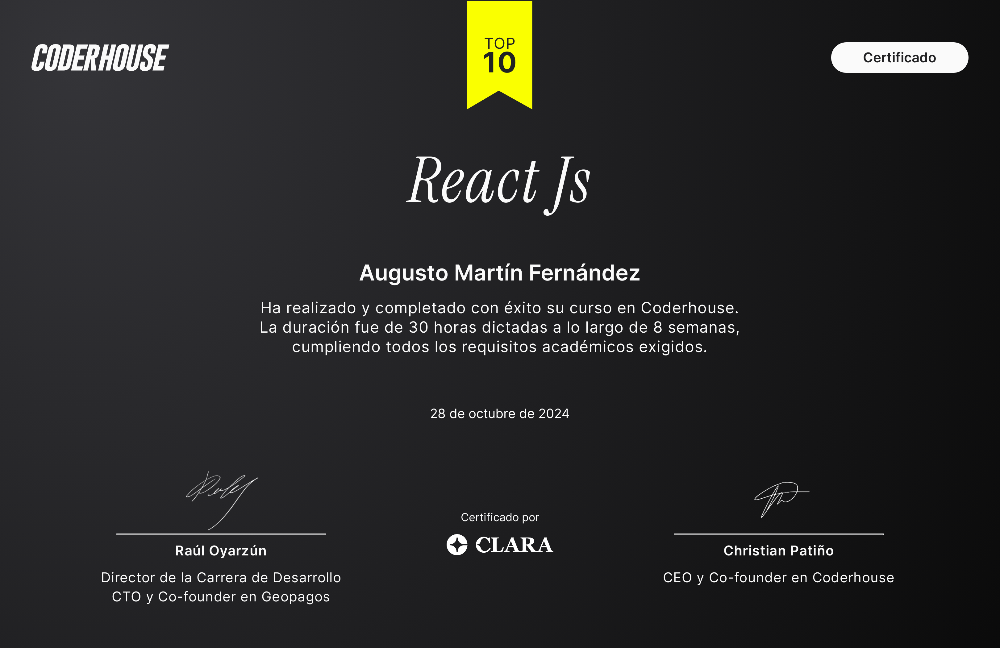

# Portfolio Martín Fernández, versión 2

Buenas. Esta es la versión 2 de mi portfolio personal. La versión 1 la hice durante mi formación en Coderhouse, y esta la armé para la unidad de Introducción Web de Programación III, en la Tecnicatura Universitaria en Programación de la UTN FRGP.

## Mis certificados

Estos son los tres cursos de Coderhouse con los que empecé en el desarrollo web. Los certificados de Desarrollo Web y de React Js llevan la insignia Top 10 de Coderhouse.

|  |  |  |
|:--:|:--:|:--:|
| **Desarrollo Web** · 11 de octubre de 2023 · 38 horas | **JavaScript** · 18 de enero de 2024 · 36 horas | **React Js** · 28 de octubre de 2024 · 30 horas |

## Índice

1. [Por qué hice una versión 2](#por-qué-hice-una-versión-2)
2. [Cómo era la versión 1](#cómo-era-la-versión-1)
3. [Qué cambié y por qué](#qué-cambié-y-por-qué)
4. [Cómo funciona el portfolio](#cómo-funciona-el-portfolio)
5. [Cómo lo armé](#cómo-lo-armé)
6. [Cómo correrlo](#cómo-correrlo)
7. [Contacto](#contacto)

## Por qué hice una versión 2

Mi primer portfolio lo hice en Coderhouse, en el curso de Desarrollo Web, donde aprendí HTML y CSS junto con Bootstrap, Sass, la metodología BEM y nociones de SEO. Desde entonces pasaron unos años y aprendí mucho más, tanto en Coderhouse con JavaScript y React como en la universidad.

Además, la cátedra de Introducción Web me pidió armar un portfolio como una sola página, y eso me dio la excusa para actualizarlo. Lo hablé con la profesora y me permitió aplicar lo que ya sabía de Coderhouse, así que partí de mi versión anterior, la revisé entera y la rehíce con mejor estructura, mejor diseño y más cuidado en accesibilidad y SEO.

La consigna pedía esto y así lo resolví.

| Lo que pedía la consigna | Cómo lo resolví |
|---|---|
| Una sola página con secciones | Un solo `index.html` con siete secciones ancladas (`inicio`, `sobre-mi`, `skills`, `certificados`, `proyectos`, `redes` y `contacto`) |
| Menú de navegación | Barra fija con menú lateral en celular y tablet (Offcanvas de Bootstrap) y barra horizontal desde 1200 px |
| Foto de perfil y descarga de CV | Foto circular en la presentación y botón «Descargar CV» con el atributo `download` |
| Paleta de colores en variables | Variables de Sass y propiedades personalizadas en `:root` |
| Proyectos en tarjetas | Tarjetas con imagen, descripción corta y botones hacia el código y la demo |
| Redes sociales | Sección de redes con LinkedIn, GitHub y correo |
| Formulario de contacto | Formulario de cinco campos que envía el mensaje con EmailJS |
| Buenas prácticas de SEO | Título, descripción, palabras clave, `robots`, un solo `h1` con la palabra clave y jerarquía de encabezados ordenada |

Donde me aparté de la consigna (Bootstrap, Sass, EmailJS y un poco de JavaScript) fue con el visto bueno de la profesora.

## Cómo era la versión 1

La versión 1 tenía cinco páginas HTML separadas (`index`, `sobremi`, `servicios`, `proyectos` y `contacto`). Usaba estas herramientas.

- HTML5 y CSS3, con el CSS escrito a partir de Sass (15 parciales).
- Bootstrap 5.3.1 por CDN, con su JavaScript.
- Animaciones con AOS y animate.css.
- Un formulario de contacto con EmailJS y avisos con Toastify.
- La tipografía Mooli de Google Fonts, más Roboto Slab en una página.
- Íconos propios en PNG y SVG dentro de la carpeta de imágenes.

Cuando la revisé para hacer esta versión encontré cosas para corregir, por ejemplo dos etiquetas `<main>` en el mismo documento, un `id` repetido, una jerarquía de encabezados salteada, favicons que no cargaban y hojas de estilo que no coincidían con el Sass que las generaba. Todo eso lo corregí en la versión 2.

## Qué cambié y por qué

| Tema | Versión 1 | Versión 2 |
|---|---|---|
| Estructura | Cinco páginas HTML separadas | Una sola página con siete secciones |
| Navegación | Menú repetido en cada página | Navbar fija con menú lateral en celular y tablet |
| Animaciones | AOS y animate.css | Solo transiciones de CSS, sin librerías de animación |
| Íconos | PNG y SVG propios | Bootstrap Icons para la interfaz y Devicon para las tecnologías |
| Sass | 15 parciales, desincronizados con el CSS | Carpetas `utils`, `base`, `layout`, `components` y `sections`, compiladas con un script de npm |
| Colores | Valores sueltos en varios archivos | Variables de Sass y propiedades personalizadas en `:root` |
| Responsive | Bloques distintos para cada tamaño | Mobile first con dos mixins de `min-width` |
| Tipografía | Mooli y Roboto Slab | Solo Mooli, con escala en `rem` |
| Accesibilidad | Sin revisar | Un `h1`, `alt` en todas las imágenes, `aria-label` en los íconos y foco visible |

## Cómo funciona el portfolio

### Estructura de archivos

```text
PortfolioMartinFernandez/
├── index.html
├── css/
│   └── styles.css          compilado desde Sass
├── scss/
│   ├── styles.scss         importa todos los parciales en orden
│   ├── utils/              _variables, _mixins
│   ├── base/               _reset, _tipografia
│   ├── layout/             _seccion, _navbar, _panel-pie, _footer
│   ├── components/         _botones, _tarjeta, _galeria, _mosaico, _formulario
│   └── sections/           _inicio, _sobre-mi, _conocimientos, _certificados,
│                           _proyectos, _redes, _contacto
├── js/
│   ├── navbar.js           menú lateral y link activo
│   └── form.js             formulario de contacto
├── img/                    fotos, certificados, capturas y favicon/
├── cv/                     currículum en PDF
└── package.json            scripts para compilar Sass
```

### HTML

Usé HTML semántico. La página tiene un `header` con la navegación, un único `main` con las siete secciones, y un `footer`. El `h1` es mi nombre junto con el título «Desarrollador de Software · .NET», que es la palabra clave principal. Los encabezados siguen un orden sin saltos (`h1`, `h2`, `h3`).

Los certificados, sus temarios y las fichas de los proyectos se abren en diez modales de Bootstrap, así que la página queda corta y cada detalle se ve cuando se lo pide.

### Librerías y de dónde salen

Todas vienen de un CDN, y cada una con la versión fijada, sin usar `@latest`, para que una actualización de la librería no me rompa el sitio. Bootstrap además lleva el atributo `integrity`, que hace que el navegador verifique que el archivo no fue modificado.

| Librería | Versión | Para qué la uso | Origen |
|---|---|---|---|
| Google Fonts (Mooli) | — | Tipografía de todo el sitio | fonts.googleapis.com |
| Bootstrap (CSS) | 5.3.1 | Menú lateral, modales y utilidades | cdn.jsdelivr.net |
| Bootstrap (JS bundle) | 5.3.1 | Hace funcionar el menú lateral y los modales | cdn.jsdelivr.net |
| Bootstrap Icons | 1.13.1 | Íconos de la interfaz (menú, botones, redes) | cdn.jsdelivr.net |
| Devicon | 2.17.0 | Logos de las tecnologías en la sección Skills | cdn.jsdelivr.net |
| Toastify | 1.12.0 | Avisos de envío del formulario | cdn.jsdelivr.net |
| EmailJS | 4.4.1 | Enviar el formulario sin un servidor propio | cdn.jsdelivr.net |

En el `head` también hay dos `preconnect` a Google Fonts, que le avisan al navegador que va a pedir la tipografía y hacen que la conexión se abra antes.

### Sass y CSS

El archivo `scss/styles.scss` importa los parciales en este orden: `utils`, `base`, `layout`, `components` y `sections`. Son unas 1.600 líneas de Sass que compilan a unas 1.500 de CSS.

- **Variables.** Los colores, los breakpoints y el radio de las esquinas están en `utils/_variables.scss`. Cada color también se publica como propiedad personalizada en `:root`, así que el CSS usa `var(--color-primario)` y cambiar un color es cambiar una sola línea.
- **Mixins.** Hay mixins para los breakpoints (`tablet` y `escritorio`), y otros para los recuadros oscuros y el efecto de elevación al pasar el mouse.
- **Bucles.** `@for` genera la animación escalonada de los links del menú lateral, y `@each` recorre un mapa con los colores de cada red social.
- **Nombres.** Las clases siguen la metodología BEM, por ejemplo `tarjeta__imagen` o `boton--contorno`.
- **Tipografía.** Todo está en `rem`, y las descripciones de las tarjetas se cortan con `line-clamp` para que todas midan lo mismo.

### Diseño responsive

Es mobile first, o sea que los estilos base son los del celular y los de pantallas más grandes se suman con `min-width`. Hay dos breakpoints.

| Nombre | Desde | Qué cambia |
|---|---|---|
| `tablet` | 768 px | Las galerías pasan de scroll horizontal a grilla, y los párrafos y la ficha se reacomodan |
| `escritorio` | 1200 px | El menú lateral se reemplaza por la barra horizontal y las secciones ganan columnas |

En celular, los certificados y los proyectos se deslizan de costado con `scroll-snap`, y desde tablet pasan a una grilla. Las secciones alternan fondo blanco y negro para separar el contenido.

### JavaScript

El JavaScript propio son dos archivos de poco más de 100 líneas en total, y el resto viene de Bootstrap, EmailJS y Toastify.

- **`navbar.js`** marca en el menú el link de la sección activa. Cuando se toca un link con el menú lateral abierto, espera a que se cierre y recién ahí hace el scroll, respetando el espacio que deja la barra fija.
- **`form.js`** toma los datos del formulario y los envía con EmailJS. Mientras se envía deshabilita el botón, y al terminar muestra un aviso de Toastify en violeta si salió bien o en rojo si falló. Si la librería no cargó, muestra el aviso de error en lugar de romper la página.

El formulario tiene cinco campos (nombre, email, teléfono opcional, asunto y mensaje).

### Imágenes e íconos

- Las imágenes que están dentro de los modales llevan `loading="lazy"` y sus medidas (`width` y `height`), así que no se descargan hasta que hacen falta y no mueven el diseño.
- Todas las imágenes tienen `alt`.
- Los proyectos que todavía no tienen captura muestran una imagen de reemplazo.
- Los íconos decorativos llevan `aria-hidden`, y los links que son solo un ícono llevan `aria-label`.
- Los favicons están en `img/favicon/`.

### Accesibilidad y SEO

- `title` con la palabra clave y mi nombre, `description` con llamado a la acción, `keywords` y `robots`.
- `lang="es"`, `charset` y `viewport` bien declarados.
- Un solo `h1`, y textos ocultos con `visually-hidden` para que los botones «Ver código» digan de qué proyecto son.
- Estilo de foco visible con `:focus-visible`, y animaciones que se desactivan con `prefers-reduced-motion`.

## Cómo lo armé

Empecé revisando mi portfolio anterior y leyendo la consigna de la cátedra. Con eso definí la paleta, la tipografía, los breakpoints y la estructura, y armé el proyecto.

Lo que aprendí en Coderhouse y apliqué acá es la estructura semántica de HTML, la metodología BEM, Bootstrap, Sass (variables, mixins, `@extend` y parciales), las nociones de SEO y el envío del formulario con EmailJS.

## Cómo correrlo

Para ver el sitio alcanza con abrir `index.html` en el navegador, y lo más cómodo es usar la extensión Live Server de VS Code. Para modificar los estilos hace falta Node.

```text
npm install
npm run build:css
npm run watch:css
```

`build:css` compila Sass una vez y `watch:css` lo vuelve a compilar cada vez que guardo un cambio.

